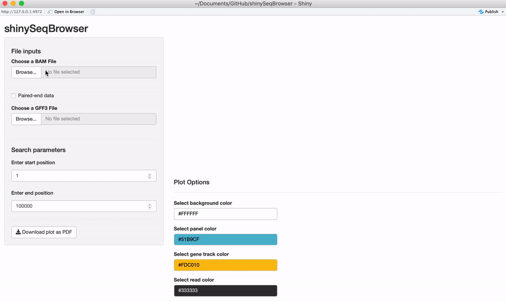
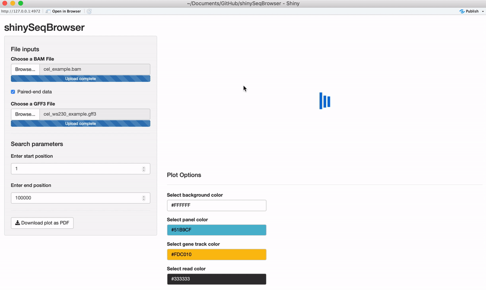
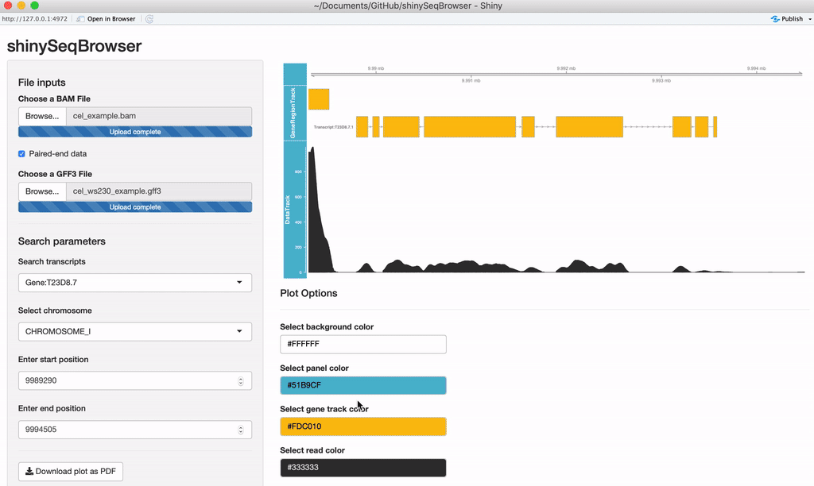
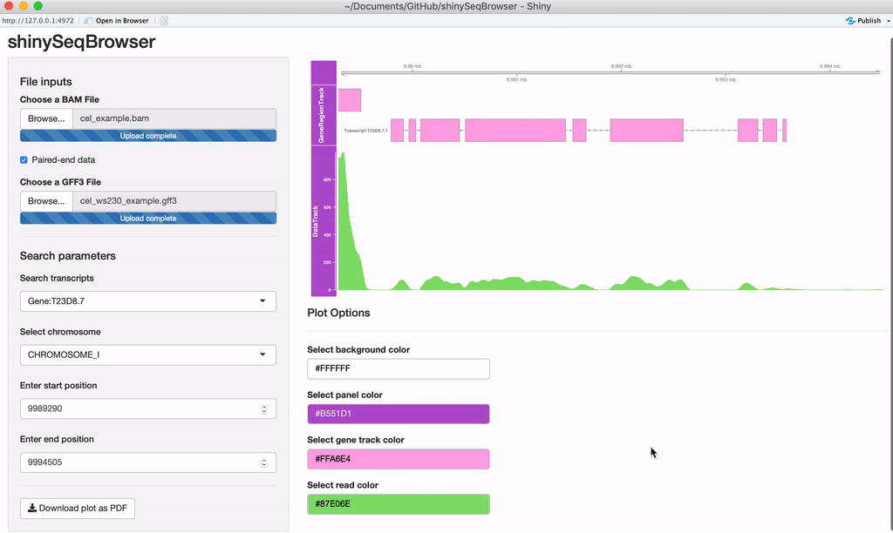

# shinySeqBrowser: An R shiny web application for exploring read data across a genome

`shinySeqBrowser` is similar to genome browser tools (such as IGV), mainly built around the R package `Gviz`. I created this project to learn how to build R shiny apps and how to use the Gviz/GenomicFeatures/etc packages, all while providing something potentially useful for my lab. The main purpose is to be able to explore RNA-seq data across specific transcripts and easily export these plots for publications. This tool is still under development and feedback/issue reporting is welcome. 

## Features
* Analyze read coverage of your BAM files
* Search transcripts by name, select regions by position/chromosome
* Customize styling and export plots for publication

## Requirements
In order to use this app you need to first install `R` from [cran-r](https://cran.r-project.org/). I recommend that you also install [RStudio](https://www.rstudio.com/) to make your life easier if you plan on using R long-term. 

Install the following dependencies from within R:
```
# Shiny related
install.packages("shiny")
install.packages("shinycssloader") # for the loader animation
install.packages("colourpicker") # for modifying plot colors

# Other packages
install.packages("Cairo") # for exporting PDF

# Bioconductor tools
source("http://bioconductor.org/biocLite.R")
biocLite("Gviz")
biocLite("Rsamtools")
biocLite("GenomicFeatures")
biocLite("GenomicRanges")
```

## Running the app
Then the easiest way to run the app is to run these commands from within R/RStudio:
```
library(shiny)
runGitHub("shinySeqBrowser", "biokcb")
```

If you want to clone the repository and make modifications to run on your local machine, you can use:
```
git clone https://github.com/biokcb/shinySeqBrowser.git
```
Then in R/Rstudio, run the app by directing the command to where the folder was downloaded after modifications. 
```
library(shiny)
runApp('path/to/shinySeqBrowser/')
```

## Usage
**Upload your data:** Once the app is up and running, you'll need to upload an aligned, sorted BAM file and an annotation file (GFF3/GTF). If the data is paired-end, you'll want to check that box as well. 



**Search Parameters:** Once the annotation file is uploaded, the chromosomes and search options should appear. If you recieve an error here then something is wrong with your GFF file and `GenomicFeatures` package cannot parse it for some reason. 

A plot should load after everything is uploaded. Every time a modification is made the plot will reload and a loading animation will appear to indicate it is updating (thanks to `shinycssloader`!). So if you do not see this animation, nor the plot, nor an error, something may be wrong. From here you can search a transcript by name or browse a chromosome by region. 



**Modify plot colors:** You can modify the plot coloring using the color palette of your choice, `colourpicker` allows you to pick a color from a palette or enter the value so you can match the color schemes of your figures instead of having to modify this in post-processing. 



**Exporting:** Once you're happy with it, you can save the plot as a vector-editable PDF!



## Contributing
I do not have contributing guidelines for this repository yet, but if you would like to contribute to the code feel free to fork the repository and create a new branch for your feature, bug fix, etc then create a pull request. Collaborative draft pull requests also welome. Create an issue if you have run into a bug or have a suggestion. Thanks!

### What's next
To give you an idea of what I am working on next or where you might be able to contribute, here are the ideas I have that I would like to add as time goes on. This is very much a work in progress!
  * Testing different files, finding bugs, and fixing them :)
  * Upload genome & view sequence base information
  * Split stranded reads
  * Convert start/stop input to a slider range 
  * Compare >1 BAM file
  * Add multiple plot styles available through `Gviz`
  * Collapse and uncollapse transcripts/isoforms
  * Load a UCSC genome
  * More plot modification options: text, scale

## Authors
  * **Kristen Brown**  ([*biokcb*](https://github.com/biokcb)) - *Colorado State University*

See also the list of [contributors](https://github.com/biokcb/shinySeqBrowser/contributors) for more on who has participated.

## License
Due to R shiny being licensed GPLv3, I believe this app must also be licensed GPLv3, but it is unclear to me.. clarifications welcome. :) See the [LICENSE](LICENSE).

## Acknowledgements
As this was a new set of tools and learning experience for me, there was quite a lot of reading and searching involved and it would have taken significantly more time and effort to produce without these resources. To create this I mainly followed the `Gviz` [user guide](https://bioconductor.org/packages/release/bioc/vignettes/Gviz/inst/doc/Gviz.pdf), the Shiny [tutorials](http://shiny.rstudio.com/tutorial/), function descriptions and community page, good ol' stackoverflow, and some useful articles from Dave Tang's [blog](https://davetang.org/muse). GIFs captured with Kap.
